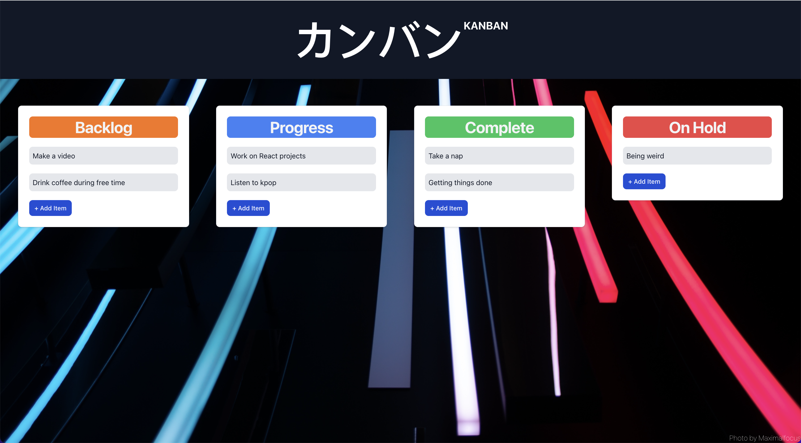

# Welome to KANBAN by Darren Chua

This project was created for personal use with React + TailwindCSS. [KANBAN](https://kanban-e5mn.onrender.com/)

### Manual (About the app)
On first startup, app will check for the presence of data in the localStorage, and set default values if non is found. On laptop (large and medium devices), Drag and Drog API is supported by the browser. CRUD is supported by adding item through the button, editing by double-clicking and deleting by pressing ok without a value.

### Limitations
Drag and Drop API is not supported by smartphones (small screens). Only CRUD is available.

public/MyImages/preview.png